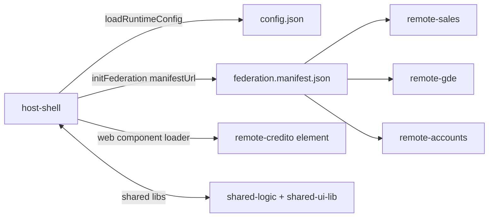

# Angular MFE POC (Native Federation)

## Visao geral
POC de Microfrontends (MFE) em Angular usando Native Federation, com um host que orquestra remotes federados e um web component isolado para provar convivencia de versoes. Fontes: `host-shell/src/main.ts`, `host-shell/src/app/app.routes.ts`, `host-shell/src/app/web-components/web-component-config.ts`.

Componentes principais:
- Host shell (layout, roteamento, menu, telemetria e shell API). Fontes: `host-shell/src/app/app.component.ts`, `host-shell/src/app/app-shell.component.ts`, `host-shell/src/app/app.config.ts`.
- Remotes federados (Sales, GDE, Accounts) expondo rotas para o host. Fontes: `remote-sales/federation.config.js`, `remote-gde/federation.config.js`, `remote-accounts/federation.config.js`.
- Web component (Credito) em Angular 19 carregado por loader dedicado. Fontes: `remote-credito/src/element.ts`, `host-shell/src/app/credito-element/credito-element-page.component.ts`.
- Libs compartilhadas (contratos e UI). Fontes: `shared-logic/src/core.ts`, `shared-ui-lib/src/public-api.ts`.

## Arquitetura (alto nivel)

Fontes: `host-shell/src/main.ts`, `host-shell/src/app/runtime-config.ts`, `host-shell/public/federation.manifest.json`, `host-shell/src/app/web-components/web-component-config.ts`.

## Requisitos
- Node.js v22.12.0 (`.nvmrc`).
- npm 11.6.2 (packageManager). Fontes: `host-shell/package.json`, `remote-sales/package.json`.
- Angular CLI 20.x (devDependencies). Fontes: `host-shell/package.json`, `remote-gde/package.json`.

## Quickstart
Windows (PowerShell):
```bash
./start-demo.ps1
```

macOS/Linux:
```bash
./start-demo.sh
```

Para build + serve automatico (macOS/Linux):
```bash
./start-demo.sh --serve
```
Fontes: `start-demo.ps1`, `start-demo.sh`.

### Portas
- Host shell: 4200 (`host-shell/package.json`)
- Remote Sales: 4201 (`remote-sales/package.json`)
- Remote GDE: 4202 (`remote-gde/package.json`)
- Remote Accounts: 4203 (`remote-accounts/package.json`)
- Remote Credito (web component): 4304 (`remote-credito/package.json`)

## Scripts principais
- `start-demo.ps1`: build shared libs, instala, builda e inicia os dist servers (Windows). Fonte: `start-demo.ps1`.
- `start-demo.sh`: build shared libs, instala, builda e opcionalmente serve dist (macOS/Linux). Fonte: `start-demo.sh`.
- `npm run install:legacy`: instala deps com legacy peer deps (apps). Fontes: `host-shell/package.json`, `remote-sales/package.json`.
- `npm run serve:dist`: serve build estatico com http-server. Fontes: `host-shell/package.json`, `remote-gde/package.json`, `remote-accounts/package.json`, `remote-sales/package.json`, `remote-credito/package.json`.

## Estrutura do repo (resumo)
```
.
├── host-shell/              # App host (layout, roteamento, menu)
├── remote-sales/            # Remote federado: Sales
├── remote-gde/              # Remote federado: GDE
├── remote-accounts/         # Remote federado: Accounts
├── remote-credito/          # Web component (Angular 19)
├── shared-logic/            # Contratos e tokens compartilhados
├── shared-ui-lib/           # UI lib e tokens CSS
├── releases/                # Tarballs de shared-logic
├── docs/                    # Documentacao
└── start-demo.*             # Scripts de build + serve
```
Fontes: paths do repo.

## Como adicionar um novo remote (passo a passo)
1) Criar o app remoto e configurar Native Federation. Fonte de referencia: `remote-sales/federation.config.js`.
2) Expor rotas no remote (ex.: `./Routes`) e criar arquivo de rotas. Fonte: `remote-sales/src/app/sales.routes.ts`.
3) Atualizar manifest com o novo remote. Fonte: `host-shell/public/federation.manifest.json`.
4) Adicionar rota no host via `loadRemoteRoutes`. Fonte: `host-shell/src/app/app.routes.ts`.
5) Criar `public/menu.json` e `public/remote-info.json` no remote para menu e metadata. Fonte: `remote-sales/public/menu.json`, `remote-sales/public/remote-info.json`.
6) Adicionar plataforma e modulos na Home (cards). Fonte: `host-shell/src/app/app.component.ts`.
7) Ajustar scripts de build/serve (opcional). Fonte: `start-demo.ps1`, `start-demo.sh`.

## Estrategia de compartilhamento (build-time vs runtime)
- Build-time local: `shared-logic` e `shared-ui-lib` sao consumidos via `file:` (tarball e dist). Fontes: `host-shell/package.json`, `remote-sales/package.json`, `shared-ui-lib/package.json`, `shared-logic/package.json`.
- Runtime Federation: `shareAll` + singletons para Angular, `rxjs` e libs compartilhadas, com `strictVersion` ajustado. Fontes: `host-shell/federation.config.js`, `remote-sales/federation.config.js`.

Trade-offs:
- `strictVersion: false` para Angular reduz friccao de upgrades, mas aumenta risco de incompatibilidade em runtime. Fonte: `host-shell/federation.config.js`.
- `strictVersion: true` para `shared-logic/shared-ui-lib` garante contratos consistentes, mas exige alinhamento de versao. Fonte: `remote-gde/federation.config.js`.

## Troubleshooting
- Manifesto nao carrega: validar `config.json` e `federation.manifest.json`. Fontes: `host-shell/public/config.json`, `host-shell/public/federation.manifest.json`.
- CORS/404 em menu.json: verificar `public/menu.json` e `http-server --cors`. Fontes: `remote-*/public/menu.json`, `remote-*/package.json`.
- Versao Angular incompativel: revisar `strictVersion` e versoes dos pacotes. Fontes: `host-shell/federation.config.js`, `remote-*/package.json`.
- Web component Credito nao carrega: checar `remote-info.json` e handshake. Fonte: `remote-credito/public/remote-info.json`, `host-shell/src/app/credito-element/credito-element-page.component.ts`.
- Erro de integridade no `shared-logic.tgz`: regerar via `start-demo` e conferir lockfiles. Fonte: `start-demo.ps1`, `start-demo.sh`.

## Docs
- Arquitetura: `docs/ARCHITECTURE.md`
- Desenvolvimento: `docs/DEVELOPMENT.md`
- Deploy: `docs/DEPLOYMENT.md`

## Issues / Improvements
- `start-demo.ps1` sempre inicia dist servers; `start-demo.sh` usa `--serve` (inconsistencia de fluxo). Fontes: `start-demo.ps1`, `start-demo.sh`.
- `host-shell/src/assets/*` nao e referenciado nem incluido nos assets do build. Fontes: `host-shell/angular.json`, `host-shell/src/assets/icons.js`.
- `remote-credito` usa Angular 19 enquanto o restante esta em 20; manter isolamento via web component e documentar compatibilidade. Fontes: `remote-credito/package.json`, `host-shell/package.json`.
